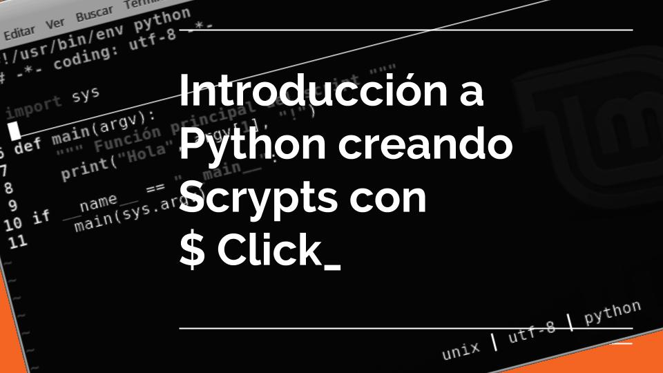

| Impartido por | Twitter | Telegram | Github |
| ------------- | ------- | -------- | ------ |
| **Perla Godinez** | @Perla_GCastillo | Perla Castillo | @PerlaGCastillo |
| **Jose Carlos Melgoza** | @Jose_Carlos_Mz | Jose Carlos Melgoza | - |
| **Ricardo Torres** | @rctorr | @rctorr | @rctorr |


Durante este taller vamos ver una introducción al lenguaje de programación Python por medio de la creación de scripts para crear nuestros propios comandos que podrán ser utilizados desde la terminal.

Se crearán scripts muy básicos, pero que permitirán aprender a usar varios elementos del lenguaje Python y que podrán aplicar en sus propias necesidades.

## Requisitos:
- Contar con un editor de código instalado como puede ser Sublime Text, Atom, Brackets, Notpadd++, Vim, Emacs y otro que sea de tu preferencia.
- Instalar Python 3 en tu laptop, para ello sugerimos descargar Miniconda para Python 3.7 para tu sistema operativo e instalarlo con las opciones por default.
- `Miniconda`: Para instalar Python en las plataformas Windows, Mac OS y Linux con características homogéneas.
https://conda.io/miniconda.html (Para descargas)
https://conda.io/docs/user-guide/install/index.html (Instrucciones de instalación para cada sistema operativo)

- `$ Click _`: Módulo de Python que nos ayudará a simplificar la creación de scripts http://click.pocoo.org/5


## Temario:
### [Script 1. hola.py tuNombre](script_01_hola_python/)
Realizamos 5 versiones de este script, donde veremos desde com imprimir información a la salida estándar, hasta como leer los argumentos de la linea de comandos y agregar opciones como la famosa --help.

### [Script 2. holaclick.py TUNOMBRE](script_02_hola_click/)
Acá reazamos sólo 2 versiones y es similar al script `hola.py`, pero usando el módulo [`click`](http://click.pocoo.org/5).

### [Script 3. l.py PATH](script_03_lista_archivos/)
Este script es similar al comando `ls` de Linux o Mac o al `dir` de Windows e imprimirá en la salida estándar la lista de archivos del directorio indicado por PATH, se incluyen varias versiones donde apulatinamente se van agregando opciones com son `--to-csv`, `--to-html` o `--to-xls`.

### [Script 4. genpass.py](script_04_genera_constrasena/)
Este script genera una o más claves seguras usando como base el alfabeto inglés en mayúsculas, minúsculas y digitos, además se puede indicar la longitud de la clave y si se desea o no incluir algunos símbolos como parte de la misma.

### [Script 5. catxml.py](script_05_desmembrando_xml/)
Este script imprime en la salida estándar en forma de árbol los nodos de cualquier xml incluyando la data y los atributos. Las distintas versiones van agregando opciones que permiten que el formato de impresión pase de texto a raw, html o filtrando nodos o atributos.


## Presentaciones:
- [Crea-tus-propios-comandos-en-Python-1.pdf](presentaciones/Crea-tus-propios-comandos-en-Python-1.pdf)
- [Crea-tus-propios-comandos-en-Python-2.pdf](presentaciones/Crea-tus-propios-comandos-en-Python-2.pdf)
- [Crea-tus-propios-comandos-en-Python-3.pdf](presentaciones/Crea-tus-propios-comandos-en-Python-3.pdf)


## El intérprete de Python
El intérprete de Python es una gran herramienta disponible en todo momento para ejecutar pruebas de código de forma inmediata, debido a que Python es un lenguaje interpretado.

### iPython
`iPython` es un shell interactivo que añade funcionalidades extra al modo interactivo incluido con Python, como resaltado de líneas y errores mediante colores, una sintaxis adicional para el shell, autocompletado mediante tabulador de variables, módulos y atributos; entre otras funcionalidades.

Instalando ipython:
```$ pip install ipython```

## Todos los script funcionan correctamente en las siguientes plataformas
- PC
  - Windows 10, aunque seguramente puedan funcionar en versiones de Win7, 8 o siempre y cuando puedas instalar la versión de Python 3.5 o mayor.
  - Linux, los scripts se ejecutaron en Debian Jessy, Linuxmint 18.03 y VoidLinux todas x86_64, la razón es que en todas se logró instalar miniconda sin problema.

- Mac OS, aquí los script se ejecutaron en Mas OS 10 Mohave, pero si se cuenta con una versión de Python 3.5 o mayor instalada muy posiblemente los scripts funcionarán sin problema.

- [ARMV6 / ARMV7](raspberry_pi/)
  - Rasberry Pi 1 y 3, los script se ejecutaron usando Raspbian GNU/Linux 9 (stretch) como sistema operativo y [Berryconda](https://github.com/jjhelmus/berryconda) como distribución de Python 3.6.
  - También está disponible la imagen 8GB configurada + berryconda3 + ipython + click + scripts del repo + archivos extras para hacer funcionar los scripts:
  
       |                       | Imagen   |
       | --------------------- | -------- |
       | Mega                  |[2018-12-02-raspbian-stretch-berryconda.img.xy](https://mega.nz/#!RbhmBQrS!nTaG9L5bHLSBjJ-L2EsVUTiP-WwUrZgTuFXZeVQlI78) |
       | Torrent 1            | [2018-12-02-raspbian-stretch-berryconda.torrent](https://github.com/rctorr/PythonMexico/raw/master/Introducci%C3%B3n-a-Python-creando-scripts-con-Click/script_05_desmembrando_xml/2018-12-02-raspbian-stretch-berryconda3.torrent)
       | Torrent 2            | [20181202RaspbianStretchBerryconda3_archive.torrent](https://github.com/rctorr/PythonMexico/raw/master/Introducci%C3%B3n-a-Python-creando-scripts-con-Click/script_05_desmembrando_xml/20181202RaspbianStretchBerryconda3_archive.torrent)
       | SHA256SUM            | a28572669a745bab35dc8fc926e5e753bea406f14c09305691ce5be3bceeb835 |
       | MD5SUM               | a8c825a1b5e20c4ade6bac10e4b5ef98 |
       
  - La imagen tiene habilitado la interface ethernet con dhcp cliente, así como acceso por ssh con el usuario: pi y clave: python2018. **IMPORTANTE** Si vas a tener la rasp conectada a Internet es altamente sugerible que cambies la clave.


## Referencias
- IPython https://es.wikipedia.org/wiki/IPython


## Enlaces
- Berryconda https://github.com/jjhelmus/berryconda
- Miniconda https://conda.io/miniconda.html
- Módulo click http://click.pocoo.org/5
