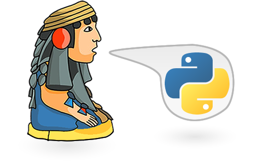

# PythonMexico

Archivos y código para las comunidades de Python México

## Talleres

- [Introducción a Python creando scripts con $ Click_](Introducción-a-Python-creando-scripts-con-Click/)

## Charlas

- [Como crear tu primer vídeo juego en Python](https://www.meetup.com/es-ES/__PyMX__/events/256111016/) en la comunidad de PyMX Nov-2018
  - [gato.py](Crea-tus-propios-juegos-en-Python/gato.py) Script que permite jugar el juego de Gato o 3 en raya a un Humano vs IA creado en menos de 45 mins
  - [gato-completa.py](Crea-tus-propios-juegos-en-Python/gato-completa.py) Script del juego de Gato o 3 en raya incluyendo comentarios e incluyendo mayor funcionalidad y validación de respuestas.

## Contribuidores

Como seguramente habrá muchas contribuciones, mejor mira las [estadísticas del repo](https://github.com/rctorr/PythonMexico/graphs/contributors)
